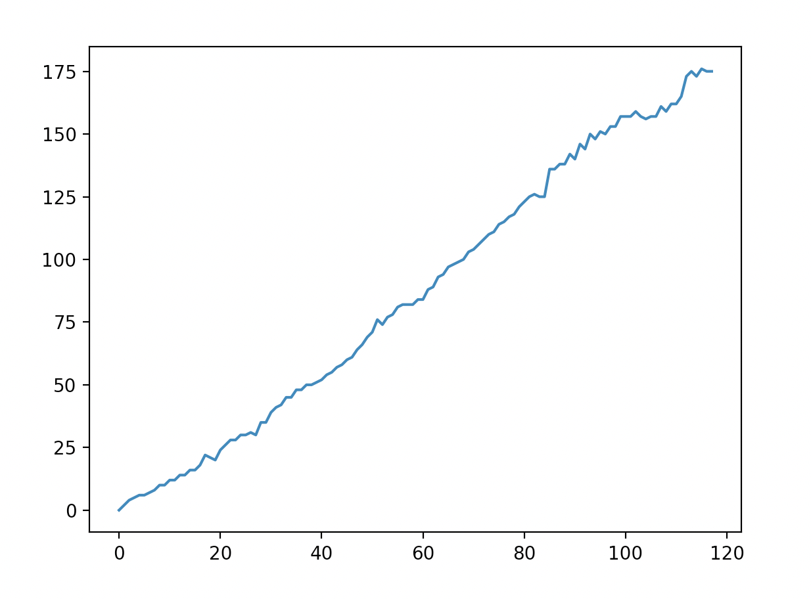

# EUREQA

## Run Code
```
python3 -X pycache_prefix=bytecodes codes/eureqa.py 
```

## Description of the problem: 
You have a real-world phenomenon, and you want to know what the function that describes its behavior.

## Project description: 
A simpler version of the Eureqa program is requested.
A data set of a real world phenomenon is given. Candidate functions to approximate
the data are of the form h(x) = f(x) + g(x), where both f and g, may be:

a) real constants: k

b) polynomials of degree less than or equal to 4

c) = k1 e^(k2*x)

d) = k1 sen(k2*x)

e) = k1 cos(k2*x)


The program must use the genetic algorithm technique to find a function h that
describe this phenomenon.


| x        | f(x)           | x        | f(x)           | x        | f(x)           |x        | f(x)           |
| ------------- |:-------------:| ------------- |:-------------:| ------------- |:-------------:| ------------- |:-------------:|
  |  1  |   0  |   2  |   2  |  3  |   4  |   4  |   5  |
  |  5  |   6  |   6  |   6  |  7  |   7  |  8  |   8  |
  |  9  |   10  |  10  |   10   |  11  |   12  |  12  |   12  |
  |  13  |   14  |  14  |   14  |  15  |   16  |  16  |   16  |
  |  17  |   18  |  18  |   22  |  19  |   21  |  20  |   20  |
  |  21  |   24  |  22  |   26  |  23  |   28  |  24  |   28  |
  |  25  |   30  |  26  |   30  |  27  |   31  |  28  |   30  |
  |  29  |   35  |  30  |   35  |  31  |   39  |  32  |   41  |
  |  33  |   42  |  34  |   45  |  35  |   45  |  36  |   48  |
  |  37  |   48  |  38  |   50  |  39  |   50  |  40  |   51  |
  |  41  |   52  |  42  |   54  |  43  |   55  |  44  |   57  |
  |  45  |   58  |  46  |   60  |  47  |   61  |  48  |   64  |
  |  49  |   66  |  50  |   69  |  51  |   71  |  52  |   76  |
  |  53  |   74  |  54  |   77  |  55  |   78  |  56  |   81  |
  |  57  |   82  |  58  |   82  |  59  |   82  |  60  |   84  |
  |  61  |   84  |  62  |   88  |  63  |   89  |  64  |   93  |
  |  65  |   94  |  66  |   97  |  67  |   98  |  68  |   99  |
  |  69  |   100  |  70  |   103  |  71  |   104  |  72  |   106  |
  |  73  |   108  |  74  |   110  |  75  |   111  |  76  |   114  |
  |  77  |   115  |  78  |   117  |  79  |   118  |  80  |   121  |
  |  81  |   123  |  82  |   125  |  83  |   126  |  84  |   125  |
  |  85  |   125  |  86  |   136  |  87  |   136  |  88  |   138  |
  |  89  |   138  |  90  |   142  |  91  |   140  |  92  |   146  |
  |  93  |   144  |  94  |   150  |  95  |   148  |  96  |   151  |
  |  97  |   150  |  98  |   153  |  99  |   153  |  100  |   157  |
  |  101  |   157  |  102  |   157  |  103  |   159  |  104  |   157  |
  |  105  |   156  |  106  |   157  |  107  |   157  |  108  |   161  |
  |  109  |   159  |  110  |   162  |  111  |   162  |  112  |   165  |
  |  113  |   173  |  114  |   175  |  115  |   173  |  116  |   176  |
  |  117  |   175  |  118  |   175  |



## Gene
```python
f_f : Function f(x)
f_g : Function g(x)
c : Constant value
k1_f : Constant k1 of f(x)
k2_f : Constant k2 of f(x)
k1_g : Constant k1 of g(x)
k2_g : Constant k2 of g(x)

```
## Chromosomes
```python
[f_f, f_g, cf, cg, k1_f, k2_f, k1_g, k2_g]
```

### To Find more information, please go to : 
https://www.tusclases.co.cr/blog/algoritmo-genetico-schedule-optimization-python
